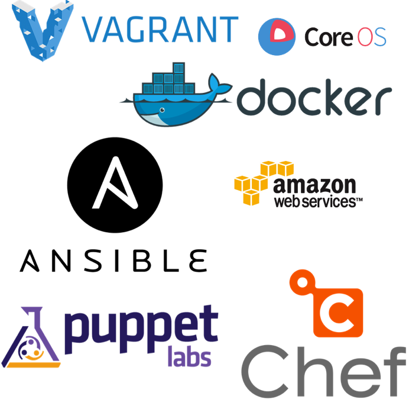

!SLIDE center
# Infracoding #

~~~SECTION:notes~~~

A brief talk about Infracoding with an introduction for those new to the topic.

First half is non-technical, more about the idea

Second half is technically focussed

** Before I get started **

Who here has any experience with Infracoding?

Who here doesnt know what infracoding is?

Hands up if you're a developer

Hands up if you're a sysadmin

Hands up if you do something different?

Who here knows anything about devops?

Who here is practicing some form of devops?

~~~ENDSECTION~~~

!SLIDE defaultsize center

## Mathew Finch ##

### "just a sysadmin" ###

@finchster

https://github.com/Finchster

~~~SECTION:notes~~~

Wife and two kids. Work for nib.

Find me around town at one of many coffee shops.

Been in IT for about 9 years. 

Always scripted where possible - vbscript, batch, bash

Practicing Infracoding for about 4yrs. 

Around 2010, shortly after moving to California from Texas.

Kickstart, provisioning, cobbler, security hardening -> lead to puppet (NSA scripts)

~~~ENDSECTION~~~

!SLIDE defaultsize center

 
## InfrastructureCoders

www.infrastructurecoders.com

~~~SECTION:notes~~~

Founded in Melbourne - now hosted around the world

594 members

Averages around 80 per meetup

Intro Matt Jones 

- cofounder of melbourne meetup 

- one of the organisers of devops days

Reason for starting in Newcastle

- Big infracoding/devops prescense in Sydney

- Alot of quality IT professionals in Newcastle (SA, Dev, QA, UX etc)

- Alot of old school IT shops

- Alot of opportunities

~~~ENDSECTION~~~

!SLIDE defaultsize light-on-dark center

## Devops

~~~SECTION:notes~~~

Infracoding and Devops go hand in hand

But they are different

Devops about breaking walls down between dev and ops teams and changing the culture

Infracoding helps devops by

- Allows ops guys to speak dev lingo

- Allows devs to understand ops config (no more black magic)

Theres already a great devops meetup in sydney and I wanted to mostly focus on the technical aspect

Devops is occuring organically in alot of places and moreso due to cloud services such as AWS

~~~ENDSECTION~~~

!SLIDE defaultsize 

## Evolution of the Sysadmin

~~~SECTION:notes~~~

The sysadmin is evolving, no longer rack and stacking and plugging in cables

This meetup will focus on treating infrastructure as code and IT automation 

We'll dig into the tools and discuss opportunities and share work

~~~ENDSECTION~~~

!SLIDE defaultsize light-on-dark center

## Infrastructure as Code

~~~SECTION:notes~~~

Introducing software development best practices into IT Infrastructure Automation

Infracoding and IT automation will lead to closer collaboration between dev and ops

~~~ENDSECTION~~~

!SLIDE center
&nbsp;

* Source control (git, svn etc)
* Testing and CI
* Environments and deployments
* Languages (Ruby/Go/Python etc)
* Work management (Agile/Scrum, Kanban etc)

!SLIDE defaultsize 

 

~~~SECTION:notes~~~

Some of the tools

Now I'm going to quickly run through some of the tools and examples

Each tool could have its own presentation so i'm just keeping it at a high level

Before I begin I just want to say that

Tools are an important part but not everything

The mindset to question status quo, 

find opportunities for efficieny gain

~~~ENDSECTION~~~

!SLIDE normalfont

# Configuration Management
## Puppet - Chef - Ansible - Salt
* Declarative
* Idempotent
* Versionable
* Centralised
* Community Driven

~~~SECTION:notes~~~

Express the state of the server

Check it into source control

Run tests against it

Promote it through environments

Never log into a server to make changes again

Ensure servers stay in check - config drift (coined by puppetlabs)

Iterate - treat changes as new features or bugs

Server config is now a product/asset

Puppet forge/Chef community - reusable modules

~~~ENDSECTION~~~

!SLIDE smallfont

# Puppet
## Linux
&nbsp;

    @@@ Puppet
    package { 'ntp':
      ensure => installed,
    }
	
    file { 'ntp.conf':
      path    => '/etc/ntp.conf',
      ensure  => file,
      require => Package['ntp'],
      source  => "puppet:///modules/ntp/conf"
    }
	
    service { 'ntp':
      name      => ntpd,
      ensure    => running,
      enable    => true,
      subscribe => File['ntp.conf'],
    }
	
~~~SECTION:notes~~~

Custom DSL - Specific to the config mgmt domain.

Simple - minimal programming experience.

Everything is a resource - Forces thinking in resources.

Compressed - more work less code.

Downside - less powerful. Looping etc... Its getting better - ruby backend

~~~ENDSECTION~~~

!SLIDE smallfont

# Chef
## Linux
&nbsp;

    @@@ Ruby
	package 'ntp'

	template '/etc/ntp.conf' do
	  source    'ntp.conf.erb'
	  notifies  :restart, 'service[ntp]'
	end

	service 'ntp' do
	  action [:enable, :start]
	end

~~~SECTION:notes~~~

Pure Ruby.

Highly customisable via Ruby.

Great suite of supporting tools, knife etc for provisioning.

~~~ENDSECTION~~~

!SLIDE smallfont

# Ansible
## Linux
&nbsp;

    @@@ Properties
	- name: Install ntp 
	  yum: name=ntp state=present
	  tags: ntp

	- name: Configure ntp file
	  template: src=ntp.conf.j2 dest=/etc/ntp.conf
	  tags: ntp
	  notify: restart ntp

	- name: Start the ntp service
	  service: name=ntpd state=started enabled=true
	  tags: ntp
	  
~~~SECTION:notes~~~

Very simple to get up and running.

Config is simple YAML, looks just like config files.

Modules to extend can be written in any language. Highly flexible.

Runs over SSH - no agents required.

Can be used for orchestration - running commands across fleets of servers.

Very young at the moment.

~~~ENDSECTION~~~

!SLIDE smallfont

# Puppet
## Windows!
&nbsp;

    @@@ Puppet
	dism { "IIS-WebServerRole":            
		ensure => present,
	}
	
	package { 'mysql':
      ensure          => '5.5.16',
      source          => 'N:\packages\mysql-5.5.16-winx64.msi',
      install_options => ['INSTALLDIR=C:\mysql-5.5'],
    }
	
	scheduled_task { 'Daily task':
	  ensure    => present,
	  enabled   => true,
	  command   => 'C:\path\to\command.exe',
	  arguments => '/flags /to /pass',
	  trigger   => {
	    schedule   => daily,
	    every      => 2,
	    start_time => '08:00', 
	  }
	}

~~~SECTION:notes~~~

Rapid development for Windows.

Alot of community driven development. Plenty of opportunities.

Powershell, DISM, IIS supported.

Reboots supported!

~~~ENDSECTION~~~

!SLIDE normalfont

# Provisioning
## Vagrant - Packer - Docker
* Automated
* Lightweight
* Platform agnostic
* Fast
* Continuous Delivery

~~~SECTION:notes~~~

Run through some tools that are configured in code for provisioning servers.

Put a new spin on traditional virtualisation.

Streamlining processes via API, cmd line - fitting with continuous delivery.

Highly automated.

~~~ENDSECTION~~~

!SLIDE smallfont

# Vagrant
## Vagrantfile
&nbsp;

    @@@ Ruby
	box      = 'precise32'
	url      = 'http://files.vagrantup.com/precise32.box'
	hostname = 'testbox'
	domain   = 'example.com'
	ip       = '192.168.0.5'
	ram      = '256'
	code_dir = 'C:/code'

	Vagrant::Config.run do |config|
	  config.vm.box = box
	  config.vm.box_url = url

	  config.vm.host_name = hostname + '.' + domain
	  config.vm.network :hostonly, ip
	  config.vm.share_folder 'code', '/home/vagrant/code', code_dir

	  config.vm.customize [
	    'modifyvm', :id,
	    '--name', hostname,
	    '--memory', ram
	  ]

	  config.vm.provision :puppet do |puppet|
	    puppet.manifests_path = 'puppet/manifests'
	    puppet.manifest_file = 'site.pp'
	    puppet.module_path = 'puppet/modules'
	  end
	end

~~~SECTION:notes~~~

Quick, lightweight, reproducible, disposable local development environments.

Uses virtual box by default in headless but can use vmware workstation, hyperv, AWS.

Ties into puppet/chef for configuring.

Based on images(boxes).

Packer can create these boxes.

~~~ENDSECTION~~~

!SLIDE commandline incremental

# Vagrant
## Commands

	$ vagrant up
	$ vagrant ssh
	$ vagrant@testbox:/home/vagrant$
	$ ...
	$ exit
	$ vagrant destroy

~~~SECTION:notes~~~

up brings up new virtual machine, first run downloads the box.

puppet is automatically run to configure the box

ssh drops you into the server. vagrant rdp coming soon!

Run commands, automated testing, etc etc..

destroy removes the VM entirely

Based on images(boxes). Many available online

Make your own - Packer can create these boxes.

~~~ENDSECTION~~~

!SLIDE smallfont code

# Packer
## Packer.json

    @@@ Javascript
	{
	  "variables": {
	    "aws_access_key": "access",
	    "aws_secret_key": "secret"
	  },
  
	  "builders": [{
	    "type": "amazon-ebs",
	    "access_key": "{{user `aws_access_key`}}",
	    "secret_key": "{{user `aws_secret_key`}}",
	    "region": "us-east-1",
	    "source_ami": "ami-de0d9eb7",
	    "instance_type": "t1.micro",
	    "ssh_username": "ubuntu",
	    "ami_name": "packer-example {{timestamp}}"
	  }],
  
	  "provisioners": [{
		"type": "puppet-masterless",
		"manifest_file": "site.pp"
	  }]
	}
	
packer build packer.json
	
~~~SECTION:notes~~~

Uses puppet/chef/shell as provisioners

Creates images for services such as amazon, gce, vmware, docker, vagrant

Same images for local dev/test/production - parallel builds

Build into CI/CD pipelines

~~~ENDSECTION~~~

!SLIDE smallfont code

# Docker
## Dockerfile
&nbsp;

    @@@ ini
	# DOCKER-VERSION 0.3.4
	FROM    centos:6.4

	# Enable EPEL for Node.js
	RUN     rpm -Uvh http://download.fedoraproject.org/epel-release-6-8.noarch.rpm
	# Install Node.js and npm
	RUN     yum install -y npm

	# Bundle app source
	ADD 	. /src
	# Install app dependencies
	RUN 	cd /src; npm install

	EXPOSE  8080
	CMD 	["node", "/src/index.js"]
	
docker build -t test-nodejs

docker run -p 80:8080 -d test-nodejs
	

~~~SECTION:notes~~~

Old school linux containers with a new age spin

Extremly fast environment provisioning (seconds)

Run docker container locally, then push it to datacenter, then to the cloud

Deploy your app inside a container

RHEL7 introducing productionised docker support

~~~ENDSECTION~~~

!SLIDE defaultsize light-on-dark center

## To The Cloud!

~~~SECTION:notes~~~

Couldn't go the whole talk without talking about the cloud.

** Who here is using any cloud services?

** What are they?

The cloud is one of the biggest driving forces behind the infracoding movement.

Operations now and into the future no longer look after the hardware, its all software.

Developers need to make their applications cloud aware.

~~~ENDSECTION~~~

!SLIDE normalfont

# Cloud Services
## AWS - Digital Ocean - GCE - Heroku - Azure
* Full API's
* Rapid provisioning
* Auto scaling
* PAAS
* Full stack as code

&nbsp;
## Sysadmins bring domain knowledge and developers bring software best practices

~~~SECTION:notes~~~

Full API's, everything can be automated

Create new server instances from API then provision with infrastructure as code

Auto scaling - add new instances based on monitoring conditions

Use the previous tools to configure these instances quickly

PAAS such as Heroku merge deployments and infrastructure together, track releases, deploy with git

~~~ENDSECTION~~~

!SLIDE normalfont

# Inside the Datacentre
## VMWare - Openstack - Hyper-V
* VMware - PowerCLI, Ruby API, Java
* Openstack - private cloud
* Put your current automation into source control
* Automation as a service
* Tests!

&nbsp;
## Sysadmins bring domain knowledge and developers bring software best practices

~~~SECTION:notes~~~

** How many people are using in house virtualisation or private clouds?

Moving to the cloud is a big job for established enterprises

Not everything can be or should be put in the cloud

Start automating today

Take your existing scripts and move them from your desktop or shared drive into source control

Pair up with a developer and start thinking about how to offer this automation as a service

Write tests against the automation, use continuous integration

~~~ENDSECTION~~~

!SLIDE smallfont 

# VMWare
## Create VM using rubygem Fog

    @@@ ruby
	require 'fog'
	
	credentials = {
	  :provider => "vsphere",
	  :vsphere_username => "root",
	  :vsphere_password => "password",
	  :vsphere_server => "vcenter",
	  :vsphere_ssl => true,
	  :vsphere_expected_pubkey_hash => "hash",
	  :vsphere_rev => "5.1"
	}
 
	connection = Fog::Compute.new(credentials)
 
	connection.create_vm( {
	  :name => 'testvm', 
	  :guest_id => '123', 
      :cpus => 2, 
	  :memory_mb => 1024, 
      :resource_pool => 'pool', 
	  :path => '/folder/test', 
	  :datacenter => 'datacenter', 
	  :volumes => {}
	})
	

~~~SECTION:notes~~~

~~~ENDSECTION~~~

!SLIDE smallfont 

# VMWare
## Create VM using Powershell PowerCLI

    @@@ Csharp
	Connect-VIServer -Server vcenter -Protocol https -User root -Password password
	
	New-VM -Name testvm -VMHost Host -ResourcePool pool -NumCPU 2 -MemoryMB 1024
	

~~~SECTION:notes~~~

~~~ENDSECTION~~~

!SLIDE normalfont

# Testing
## Test your code!
* Can you rebuild your server from scratch?
* Is it faster to rebuild and redeploy rather than a lengthy backup restore?
* Did your last Puppet change break your service?
* Does your automated database snapshot work after the last change?
* Does your provisioning still work with the latest hypervisor?

~~~SECTION:notes~~~

** How many people are using continuous integration?

** How many people are using continuous integration on thier infrastructure?

Write tests and use continuous integration to test after every change and test often

Dont know how? Pair with a developer or QA engineer, learn best practices

Tools - serverspec, kitchenci, beaker

~~~ENDSECTION~~~

!SLIDE smallfont 

# Testing as Code
## Serverspec

    @@@ Ruby
	require 'spec_helper'

	describe 'httpd' do
	  it { should be_installed }
	  it { should be_enabled   }
	  it { should be_running   }
	end

	describe 'port 80' do
	  it { should be_listening }
	end

	describe '/etc/httpd/conf/httpd.conf' do
	  it { should be_file }
	  it { should contain "ServerName localhost" }
	end

~~~SECTION:notes~~~

Chef/Puppet run on the server.

The tests should be equivalent to what system admin does when they log on to the server and check various files, directory and logs to check all is ok.

~~~ENDSECTION~~~

!SLIDE smallfont 

# Testing as Code
## Beaker - Acceptance Tests

    @@@ Ruby
	it "ensures apache works" do

	pp = "class { 'apache': }"

	apply_manifest(pp, :catch_failures => true)
	end

	describe service('httpd') do
		it { should be_running }
		it { should be_enabled }
	end

~~~SECTION:notes~~~

Written by Puppetlabs

Included in Puppet modules

~~~ENDSECTION~~~

!SLIDE normalfont

# Monitoring
## Bake it into the infrastructure
* Sensu
* Flapjack - alert rollup, event routing
* Logstash - log monitoring/parsing for metrics
* statsd/graphite
* Consul - service discovery + health checks

~~~SECTION:notes~~~

Monitoring is usually the last thing configured

Usually an after thought

Alot of metrics and health information available on the server via logs or commands

~~~ENDSECTION~~~

!SLIDE smallfont 

# Monitoring as Code
## Sensu 

On the Sensu server

    @@@ Javascript
	{
	  "checks": {
	    "check-disk-windows": {
	      "handlers": ["default"],
	      "command": "C:/sensu/embedded/bin/ruby.exe C:/sensu/plugins/check-disk-windows.rb -w 10",
	      "interval": 60,
	      "subscribers": [ "windows" ]
	    }
	  }
	}
	
On the Windows client

    @@@ Javascript
	{
	  "client": {
	    "name": "winhost",
	    "subscriptions": [
	      "windows"  
	    ]
	  }
	}

~~~SECTION:notes~~~

Runs the disk space check every 60secs and goes into Warning if below 10%

~~~ENDSECTION~~~

!SLIDE smallfont 

# Monitoring as Code
## Logstash - Cisco ASA

    @@@ Ruby
	filter {
	  # Pull the syslog part and Cisco tag out of the message
	  grok {
	    match => ["message", "%{CISCO_TAGGED_SYSLOG} %{GREEDYDATA:cisco_message}"]
	  }

	  # Parse the syslog severity and facility
	  syslog_pri { }

	  # Extract fields from each of the detailed message types - predefined grok patterns
	  grok {
	    match => [
	      "cisco_message", "%{CISCOFW106001}",
	      "cisco_message", "%{CISCOFW106006_106007_106010}",
          ...
	      "cisco_message", "%{CISCOFW710001_710002_710003_710005_710006}",
	      "cisco_message", "%{CISCOFW733100}"
	    ]
	  }

	  # Parse the date
	  date {
	    match => ["timestamp",
	      "MMM dd HH:mm:ss",
	      "MMM  d HH:mm:ss",
	      "MMM dd yyyy HH:mm:ss",
	      "MMM  d yyyy HH:mm:ss"
	    ]
	  }
	}

~~~SECTION:notes~~~

Cisco ASA firewall parsing

Output this to elasticsearch for parsing and event analysis

~~~ENDSECTION~~~

!SLIDE normalfont

# Documentation
## .. as Code!
* Infrastructure as code is self documenting.
* No longer need a server build document
* Automated provisioning means no more SOE or provisioning documents
* Everything is documented, history is kept in VCS, its always up to date.
* Consul - service discovery + health checks

~~~SECTION:notes~~~

Added benefit of infracoding.

Necessary evil.

When you move to the cloud, dont write a document on how to create instances

- Automate it! Make a portal thats easy to use.

- Even if you're on top of documentation it usually lags behind the changes

To update your infrastructure you need to update the code which is updating the documentation.

~~~ENDSECTION~~~

!SLIDE center
# Some tools are yet to be written!
## ( Hint: Storage & Networking )

~~~SECTION:notes~~~

Find the opportunities

write the tools

open source them

present your work here!

~~~ENDSECTION~~~

!SLIDE center
# Bonus Material
## Presentation as Code

https://github.com/Finchster/ic_pres

!SLIDE defaultsize center

